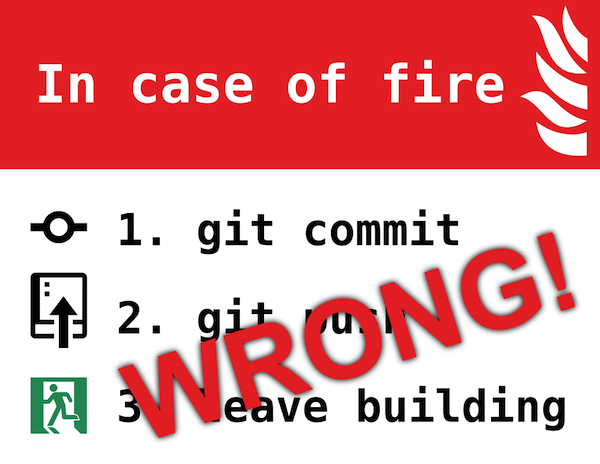

# git-evac

紧急撤离用 Git 子命令



在紧急情况下，手动输入 `git commit` 和 `git push` 是不明智的，你可能需要额外花费精力**输入评论**和处理任何可能的
**代码冲突**。

真正的编程侠是不会允许这种不严谨的做法的。

在此介绍 `git evac`。

## 依赖项

* `git` 命令
* `date` 命令，用于生成分支名
* `openssl` 命令，用于生成分支名

## 安装

**自动安装**

```shell
curl -sSL https://raw.githubusercontent.com/guoyk93/git-evac/main/install.sh | sudo bash -s
```

**手动安装**

获取脚本 `git-evac.sh` 并将其安装在 `PATH` 目录中, 比如 `/usr/local/bin`

```shell
git clone https://github.com/guoyk93/git-evac.git
cd git-evac
chmod +x git-evac.sh
sudo cp -f git-evac.sh /usr/local/bin/git-evac
```

## 使用

一旦起火，你只需要输入 `git evac` 或者 `git-evac` 然后快速离开建筑物。

`git-evac` 会帮助你:

1. 托管所有变更
2. 切换到全新的分支
3. 创建提交，并填写评论
4. 推送分支到远程服务器

## 赞助

访问 <https://guoyk.xyz/donation>

## 许可证

GUO YANKE, MIT License
